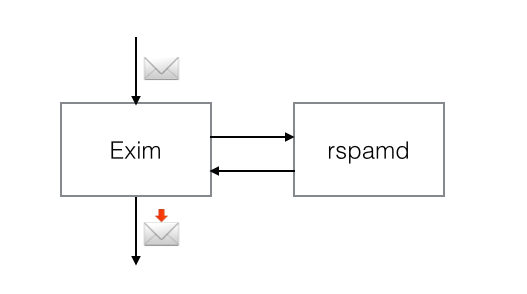

# MTA integration

This document describes several methods of integrating rspamd with some popular MTAs. Among them are:

* [Postfix](http://www.postfix.org)
* [Exim](http://exim.org)
* [Sendmail](http://sendmail.org)
* [Haraka](https://haraka.github.io/)

This document also describes the rspamd LDA proxy mode that can be used for any MTA.

## Using Rspamd with Postfix MTA

To link rspamd with Postfix it is recommended to use a tool called `rmilter`:

Rmilter can be downloaded from github: <http://github.com/vstakhov/rmilter>.

### Configuring Rmilter to work with Rspamd

First of all build and install rmilter from source (or use a binary package if applicable):

	% ./configure
	% make
	# make install

Rmilter configuration is described in its [documentation]({{ site.url }}{{ site.baseurl }}/rmilter/)
Here is a relevant example of rspamd setup within rmilter configuration file:

~~~ucl
spamd {
        # use rspamd action for greylisting
        spamd_greylist = yes;

        # use rspamd action for messages
        spamd_soft_fail = yes;

        # add extended headers for messages
        extended_spam_headers = yes;

        # servers - spamd socket definitions in format:
        # /path/to/file
        # host[:port]
        # sockets are separated by ','
        # Default: empty
        servers = spam1.example.com:11333, spam2.example.com;

        # connect_timeout - timeout in miliseconds for connecting to rspamd
        # Default: 1s
        connect_timeout = 1s;

        # results_timeout - timeout in miliseconds for waiting for rspamd response
        # Default: 20s
        results_timeout = 60s;

        # error_time - time in seconds during which we are counting errors
        # Default: 10
        error_time = 10;

        # dead_time - time in seconds during which we are thinking that server is down
        # Default: 300
        dead_time = 300;

        # maxerrors - maximum number of errors that can occur during error_time to make us thinking that
        # this upstream is dead
        # Default: 10
        maxerrors = 10;

        # reject_message - reject message for spam
        reject_message = "Spam message rejected; If this is not spam contact abuse at example.com";

        # whitelist - list of ips or nets that should be not checked with spamd
        # Default: empty
        whitelist =
                10.0.0.0/8;

}
~~~

This configuration allows rmilter to utilize all rspamd actions including greylisting.

### Configuring Postfix

Postfix configuration to scan messages on rspamd daemon via rmilter is very simple:


smtpd_milters = unix:/var/run/rmilter/rmilter.sock
# or for TCP socket
# smtpd_milters = inet:localhost:9900
milter_protocol = 6
milter_mail_macros = i {mail_addr} {client_addr} {client_name} {auth_authen}
# skip mail without checks if milter will die
milter_default_action = accept


## Integration with exim MTA

Starting from Exim 4.86, you can use Rspamd directly just like SpamAssassin:

For versions 4.70 through 4.84, a patch can be applied to enable integration. In the exim source directory run `patch -p1 < ../rspamd/contrib/exim/patch-exim-src_spam.c.diff`.

For version 4.85, run the following from `contrib/exim` in the rspamd source directory:
`patch patch-exim-src_spam.c.diff < patch-exim-src_spam.c.diff.exim-4.85.diff`
And then follow the steps above to apply the patch.

For versions 4.86 and 4.87 it is recommended to apply a patch to disable half-closed sockets:
`patch -p1 < ../rspamd/contrib/exim/shutdown.patch`

Alternatively, you can set `enable_shutdown_workaround = true` in `$LOCAL_CONFDIR/local.d/options.inc`

Here is an example of the Exim configuration:


# Please note the variant parameter
spamd_address = 127.0.0.1 11333 variant=rspamd

acl_smtp_data = acl_check_spam

acl_check_spam:
  # do not scan messages submitted from our own hosts
  accept hosts = +relay_from_hosts

  # do not scan messages from submission port
  accept condition = ${if eq{$interface_port}{587}}

  # skip scanning for authenticated users
  accept authenticated = *

  # add spam-score and spam-report header when told by rspamd
  warn  spam       = nobody:true
        condition  = ${if eq{$spam_action}{add header}}
        add_header = X-Spam-Score: $spam_score ($spam_bar)
        add_header = X-Spam-Report: $spam_report

  # use greylisting available in rspamd v1.3+
  defer message    = Please try again later
        condition  = ${if eq{$spam_action}{soft reject}}

  deny  message    = Message discarded as high-probability spam
        condition  = ${if eq{$spam_action}{reject}}

  accept


## Using Rspamd with Sendmail MTA

Sendmail can use rspamd via rmilter and configuration is just like for postfix. sendmail configuration could be like:

	MAIL_FILTER(`rmilter', `S=unix:/run/rmilter/rmilter.sock, F=T')
	define(`confINPUT_MAIL_FILTERS', `rmilter')

Then compile m4 to cf in the usual way.

## Integration with Haraka MTA

Support for rspamd is available in haraka v2.7.0+: <http://haraka.github.io/manual/plugins/rspamd.html>.

To enable: add `rspamd` to the `DATA` section of your `config/plugins` file and edit `config/rspamd.ini` to suit your preferences.

## LDA mode

In LDA mode, the MTA calls the rspamd client `rspamc` which scans a message with `rspamd` and appends scan results to the source message. The overall scheme is demonstrated in the following picture:

To enable LDA mode, `rspamc` has the following options implemented:

- `--exec "/path/to/lda params"`: executes the binary specified to deliver modified message
- `--mime`: modify message instead of printing scan results only
- `--json`: optionally add the full ouptut as base64 encoded `JSON`

Here is an example of using `rspamc` + `dovecot` as LDA implemented using `fetchmail`:

    mda "/usr/bin/rspamc --mime --exec \"/usr/lib/dovecot/deliver -d %T\""

In this mode, `rspamc` cannot reject or greylist messages, but it appends the following headers that can be used for further filtering by means of the LDA (for example, `sieve` or `procmail`):

- `X-Spam-Scanner`: name and version of rspamd
- `X-Spam`: has value `yes` if rspamd detects that a message as a spam (either `reject` or `add header` actions)
- `X-Spam-Action`: the desired action for a message (e.g. `no action`, `add header` or `reject`)
- `X-Spam-Result`: contains base64 encoded `JSON` reply from rspamd if `--json` option was given to `rspamc`

Please note that despite the fact that this method can be used with any MTA (or even without an MTA), it has more overhead than other methods and it cannot apply certain actions, like greylisting (however, that could also be implemented using external tools).
