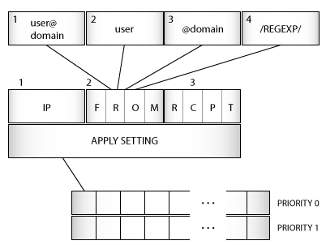

# rspamd user settings

## Introduction

rspamd allows exceptional control over the settings which will apply to incoming messages. Each setting can define a set of custom metric weights, symbols or actions. An administrator can also skip spam checks for certain messages completely, if required. rspamd settings can be loaded as dynamic maps and updated automatically if a corresponding file or URL has changed since its last update.

To load settings as a dynamic map, you can set 'settings' to a map string:

~~~ucl
settings = "http://host/url"
~~~

If you don't want dynamic updates then you can define settings as an object:

~~~ucl
settings {
	setting1 = {
	...
	}
	setting2 = {
	...
	}
}
~~~

## Settings structure

The settings file should contain a single section called "settings":

~~~ucl
settings {
	some_users {
		priority = high;
		from = "@example.com";
		rcpt = "admin";
		rcpt = "/user.*/";
		ip = "172.16.0.0/16";
		user = "@example.net";
		apply "default" {
			symbol1 = 10.0;
			symbol2 = 0.0;
			actions {
				reject = 100.0;
				greylist = 10.0;
				"add header" = 5.0; # Please note the space, NOT an underscore
			}
		}
		# Always add these symbols when settings rule has matched
		symbols [
			"symbol2", "symbol4"
		]
	}
	whitelist {
		priority = low;
		rcpt = "postmaster@example.com";
		want_spam = yes;
	}
}
~~~

So each setting has the following attributes:

- `name` - section name that identifies this specific setting (e.g. `some_users`)
- `priority` - high or low; high priority rules are matched first (default priority is low)
- `match list` - list of rules which this rule matches:
	+ `from` - match SMTP from
	+ `rcpt` - match RCPT
	+ `ip` - match source IP address
	+ `user` - matches authenticated user ID of message sender if any
- `apply` - list of applied rules, identified by metric name (e.g. `default`)
	+ `symbol` - modify weight of a symbol
	+ `actions` - defines actions
- `symbols` - add symbols from the list if a rule has matched

The match section performs `AND` operation on different matches: for example, if you have `from` and `rcpt` in the same rule, then the rule matches only when `from` `AND` `rcpt` match. For similar matches, the `OR` rule applies: if you have multiple `rcpt` matches, then *any* of these will trigger the rule. If a rule is triggered then no more rules are matched.

Regexp rules can be slow and should not be used extensively.

The picture below describes the architecture of settings matching.

